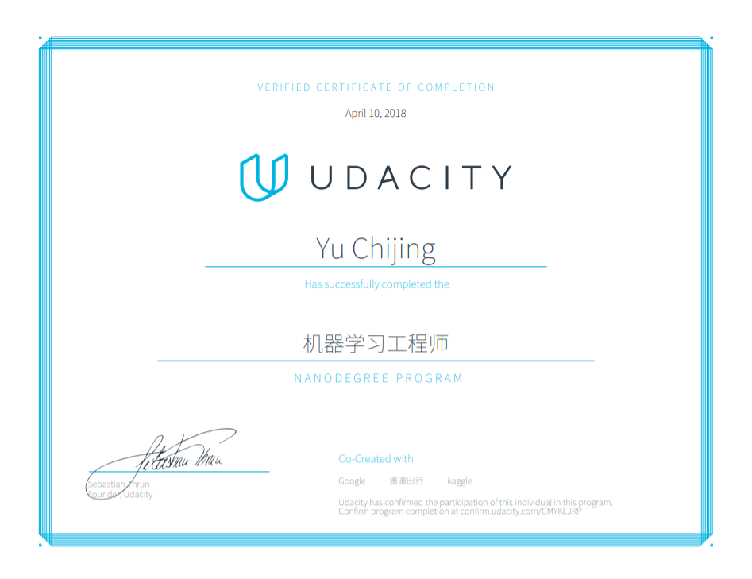

# machine-learning-nanodegree
This repository includes project reports and learning notes for Udacity MLND Nanodegree.

## Graduation
I have graduated from Udacity Machine Learning Engineer Nanodegree on April 10, 2018.

The certification is [here](https://graduation.udacity.com/confirm/AWDTZFKK).

## License

The content of this repository is licensed under a
[Creative Commons Attribution License](http://creativecommons.org/licenses/by/3.0/us/)
